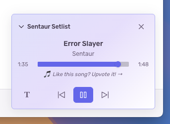
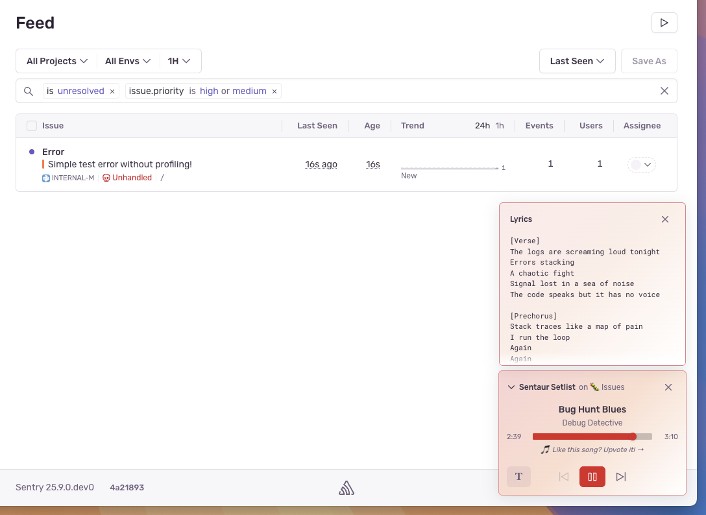
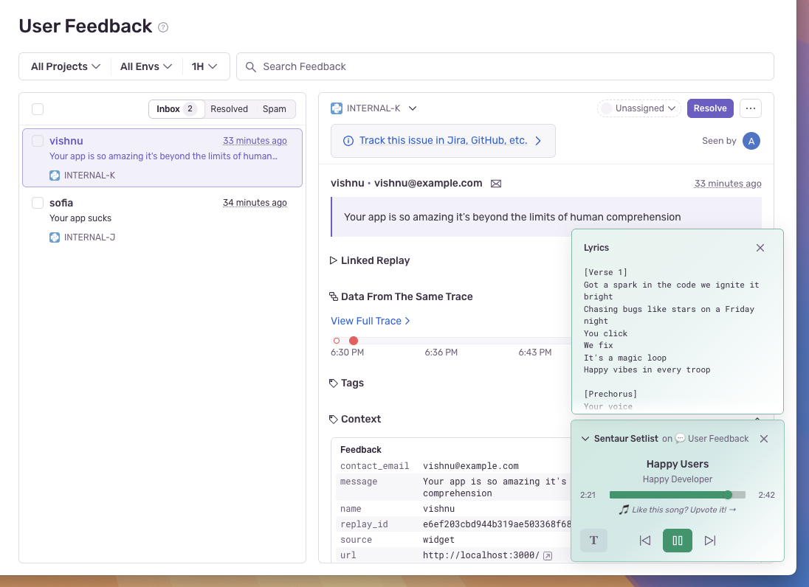
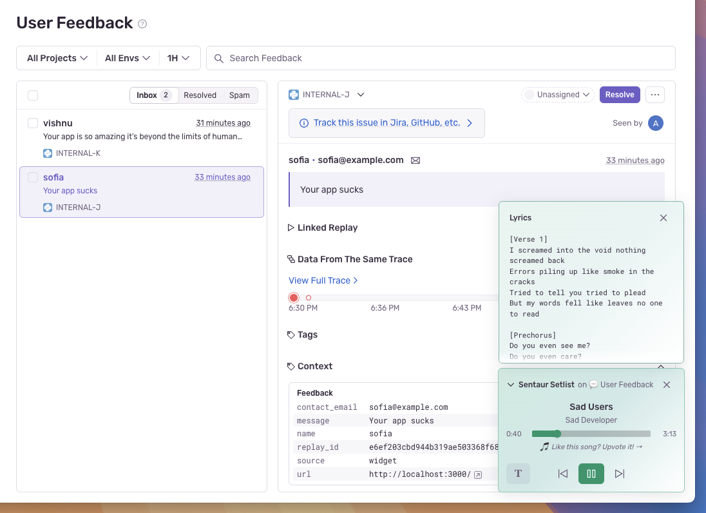
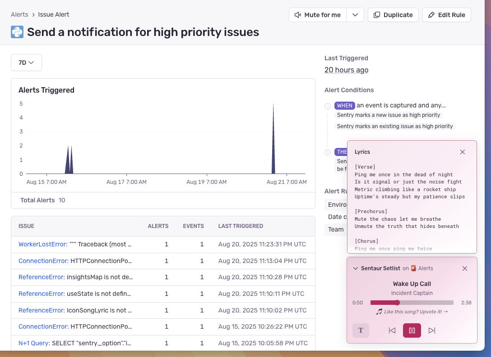

  

    
  

  

    Users and logs provide clues. Sentry provides answers.
  

# 🎵 Debug DJ: Music that matches your mood

### Hack Week project by Sofia Rest, Vishnu Satish, and Andrew Liu

A smart DJ with playlists that adapt to your browsing context--happy songs for positive feedback, epic tracks for complex bugs. Choose from fun Sentry-themed hits or Minecraft classics, with lyrics display and a compact, themed player that won't get in your way.

  
  
  
  
  

# What's Sentry?

Sentry is the debugging platform that helps every developer detect, trace, and fix issues. Code breaks, fix it faster.

  
  
  
  
  
  
  
  
  

## Official Sentry SDKs

- [JavaScript](https://github.com/getsentry/sentry-javascript)
- [Electron](https://github.com/getsentry/sentry-electron/)
- [React-Native](https://github.com/getsentry/sentry-react-native)
- [Python](https://github.com/getsentry/sentry-python)
- [Ruby](https://github.com/getsentry/sentry-ruby)
- [PHP](https://github.com/getsentry/sentry-php)
- [Laravel](https://github.com/getsentry/sentry-laravel)
- [Go](https://github.com/getsentry/sentry-go)
- [Rust](https://github.com/getsentry/sentry-rust)
- [Java/Kotlin](https://github.com/getsentry/sentry-java)
- [Objective-C/Swift](https://github.com/getsentry/sentry-cocoa)
- [C\#/F\#](https://github.com/getsentry/sentry-dotnet)
- [C/C++](https://github.com/getsentry/sentry-native)
- [Dart/Flutter](https://github.com/getsentry/sentry-dart)
- [Perl](https://github.com/getsentry/perl-raven)
- [Clojure](https://github.com/getsentry/sentry-clj/)
- [Elixir](https://github.com/getsentry/sentry-elixir)
- [Unity](https://github.com/getsentry/sentry-unity)
- [Unreal Engine](https://github.com/getsentry/sentry-unreal)
- [Godot Engine](https://github.com/getsentry/sentry-godot)
- [PowerShell](https://github.com/getsentry/sentry-powershell)

# Resources

- [Documentation](https://docs.sentry.io/)
- [Discussions](https://github.com/getsentry/sentry/discussions) (Bugs, feature requests,
  general questions)
- [Discord](https://discord.gg/PXa5Apfe7K)
- [Contributing](https://docs.sentry.io/internal/contributing/)
- [Bug Tracker](https://github.com/getsentry/sentry/issues)
- [Code](https://github.com/getsentry/sentry)
- [Transifex](https://www.transifex.com/getsentry/sentry/) (Translate
  Sentry\!)
